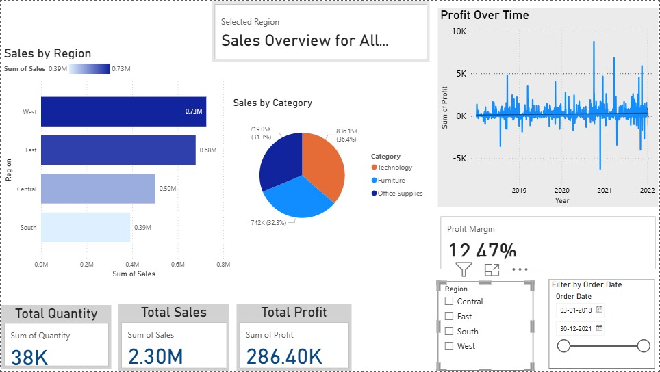
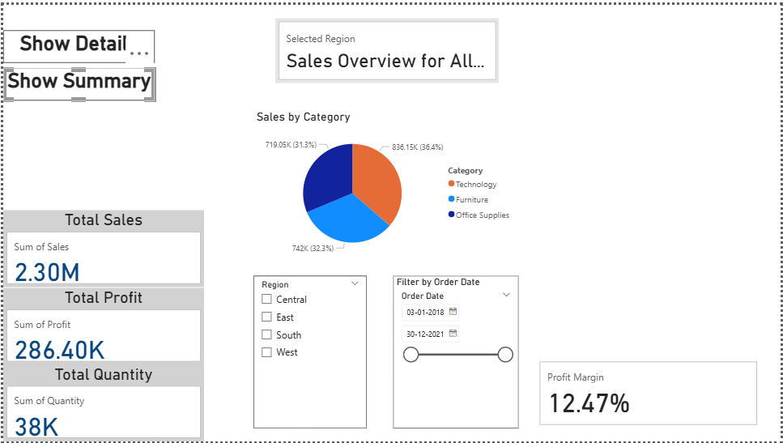
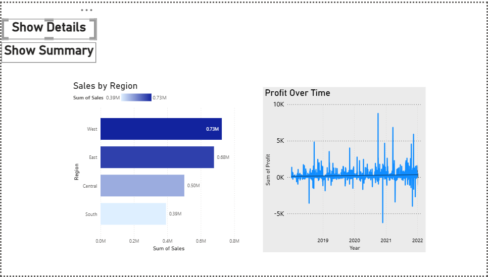

# Superstore Sales Dashboard

This is an interactive Power BI dashboard built using the Superstore dataset. It helps visualize sales trends, profits, and regional performance using dynamic visuals and user-friendly navigation.

## 📊 Features

- Summary and Detailed views using bookmarks
- KPI Cards: Total Sales, Profit, Quantity
- Regional sales and category breakdowns
- Full Dashboard view (combining all visuals)
- Slicers and synced visuals for interactivity

## 📸 Dashboard Previews

### 🔹 Full Dashboard View

### 🔹 Summary View

### 🔹 Detailed View

## 🎥 Demo Video

Click to watch the dashboard in action:

[▶️ Watch Full Demo](https://github.com/pritisingh-09/Superstore-Sales-Dashboard/raw/main/your_video_filename.mp4)

